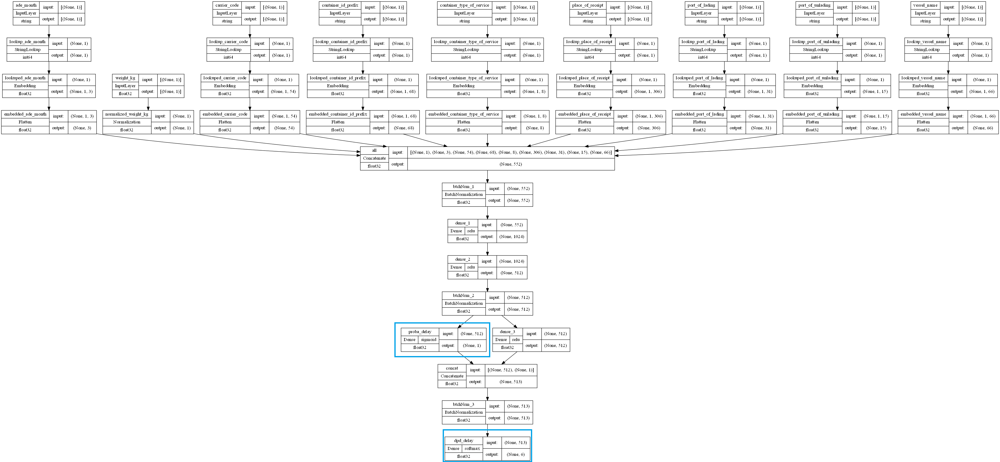
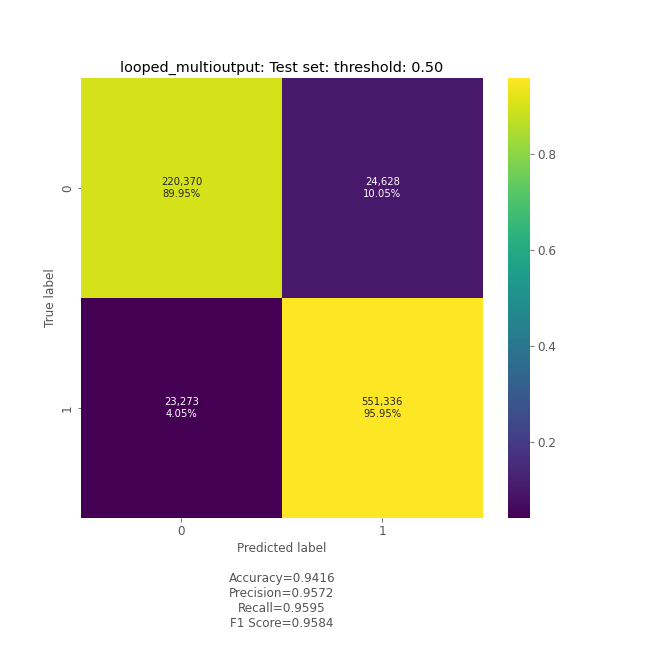
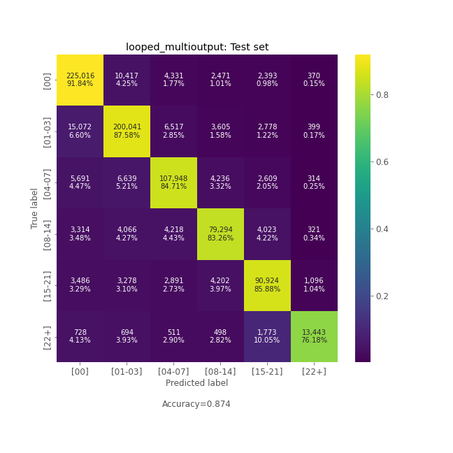

<p align="center">

</p>

# Delay Risk Prediction. USA Import.
ML project for Delay Risk Prediction in terms of difference between Estimated Arrival Date
and Actual Arrival Date.


## Objective.
We want to be able:
1. To get a probability of case that a cargo would be delayed in future after its departure.
2. In the case of a forecast delay, to predict the number of days of delay in terms of the "Days Past Due".


## Data.
As an input data it been used the preprocessed
[Bills' of Lading](https://en.wikipedia.org/wiki/Bill_of_lading)
for USA Import for 2019.01-2022.12 period.\
The dev set contains 73 764 572 records. And unseen test set consist of 8 196 064 rows.


## Model.
### Model Targets:
The model makes two predictions simultaneously:
1. `_be_dealyed` : Binary classification.\
    The probability that cargo will been delayed.
    Will arrive after Estimated Arrival Date
2. `_dpd_delayed` : Multiclass classification.\
    The probaility that cargo will arrive in particular time slot after
    Estimated Arrival Date.

        | Target label | Meaning
        |--------------|------------------------------------------------
        | '[00]'       | # Days of delaying will be <= 0 days
        | '[01-03]'    | # Days of delaying will be >= 1 and <= 3 days
        | '[04-07]'    | # Days of delaying will be >= 4 and <= 7 days
        | '[08-14]'    | # Days of delaying will be >= 8 and <= 14 days
        | '[15-21]'    | # Days of delaying will be >= 15 and <= 21 days
        | '[22+]'      | # Days of delaying will be >= 22 days
** _the **_dpd_delayed** target is predicted after the **_be_dealyed** prediction._


### Model Inputs:
```
{
    "weight_kg": [float],                         #  [6505.0]
    "ade_month": [string],                        #  ["APR"]
    "carrier_code": [string],                     #  ["BANQ"]
    "container_id_prefix": [string],              #  ["SEKU"]
    "container_type_of_service": [string],        #  ["HP"]
    "place_of_receipt": [string],                 #  ["UTTOXETER"]
    "port_of_lading": [string],                   #  ["CORYTON"]
    "port_of_unlading": [string],                 #  ["NEW YORK NY"]
    "vessel_name": [string],                      #  ["BUDAPEST BRIDGE"]
}
```
** _**ade_month** - a month of the arrival date estimated._


### Model Outputs:
The origin model's output is the list of np.arrayes with the predicted probabilities
for each target\class (time slot):
```
[
    array([[0.95719653]], dtype=float32),
    array([[0.07377038, 0.527261, 0.07299959, 0.2695898 , 0.05120277, 0.00517643]], dtype=float32)
]

```
The final model's API output is a JSON response with the short targets' descriptions\labels
and the predicted probabilities for each target\class (time slot).
```
b'{
    'targets':
    {
        'y_be_delayed': [],
        'y_dpd_delayed':
        [
            '[00]',
            '[01-03]',
            '[04-07]',
            '[08-14]',
            '[15-21]',
            '[22+]'
        ]
    },
    'predictions':
    {
        'y_be_delayed': [[0.95719653]],
        'y_dpd_delayed':
        [
            [
                0.07377038,
                0.527261  ,
                0.07299959,
                0.2695898 ,
                0.05120277,
                0.00517643
            ]
        ]
    }
```

### Model Architecture:
The model is the two-output neural net with a handful of text embedding layers.



### Model performance:
| 'be_dealyed': Binary classification |  'dpd_delayed': Multiclass classification |
|------------|--------------|
|||


## Model Training.
##### MLFlow:
1. Open [./mlflow] folder in terminal
2. `> mlflow ui`
##### Tensorboard:
1. Open [./mlflow/mlruns/<EXPERIMENT>/<MODEL>/artifacts] in terminal
2. `> tensorboard --logdir tensorboard_logs`

### Workflow's sequence:
1. ./src/delay/data/process_data.py
2. ./src/delay/model/train_final_model_dl_multiout.py
3. ./src/delay/app/
4. ./src/delay/gcp/

----
### Project's folders structure.

```
[root project's folder]
├── data             <- Contains data sources for project.
│   ├── external     <- Auxilary data from third party sources to get better view.
│   ├── final        <- The final data & dictionaries for modeling.
│   └── processed    <- Preprocessed (cleaned) B\L's data for a further work.
├── docs             <- Keeps the project`s & models documentations.
│   └── pics         <- Pictures for docs & README.
├── mlflow           <- Place to track & keep models, its params & outputs.
│   └── mlruns       <- Logged MLflow runs. Keeps models its params, metrics & artifacts.
├── tensorboard      <- Tensorflow training logs.
├── src/delay          <- Source code & scripts of this project.
│   ├── _assist      <- Any types of helping scripts & code's snippets.
│   ├── app          <- REST API client for model's application.
│   ├── aws          <- Scripts to deploy & invoke model on AWS Sagemaker.
│   ├── gcp          <- Scripts to deploy & invoke model on GCP Vertex AI.
│   ├── data         <- Scripts to acquire, explore, preclean & process data.
│   ├── model        <- Scripts to choose, fit & tune, train & evaluate models.
│   └── predict      <- Scripts to invoke & get prediction for model deployed locally.
└── README
```
